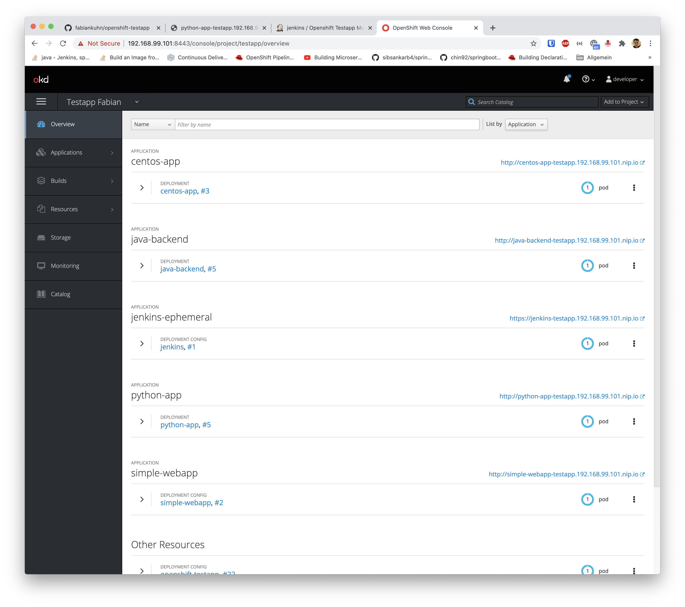
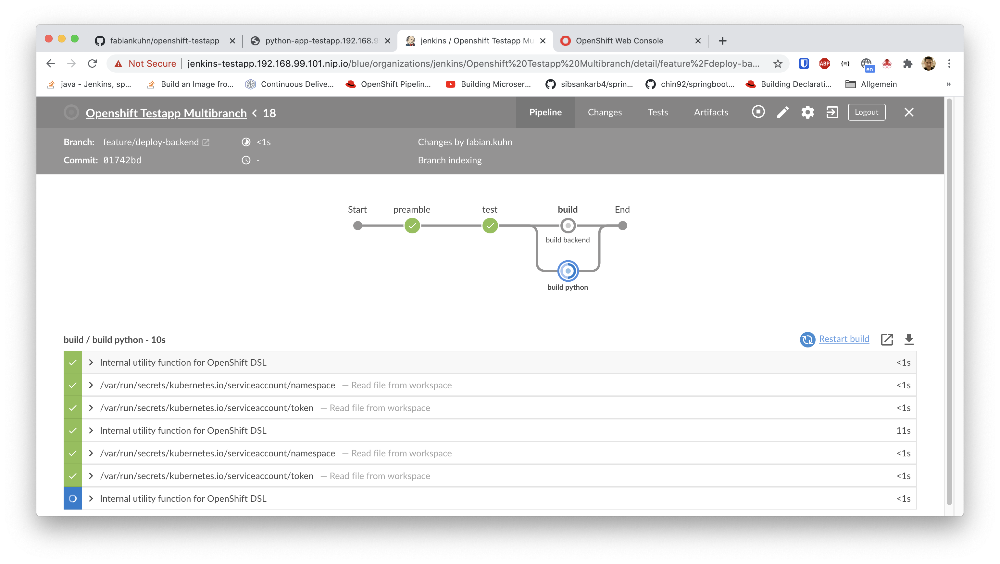
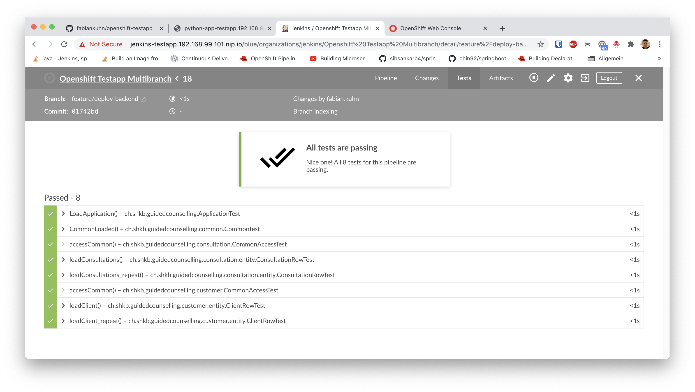
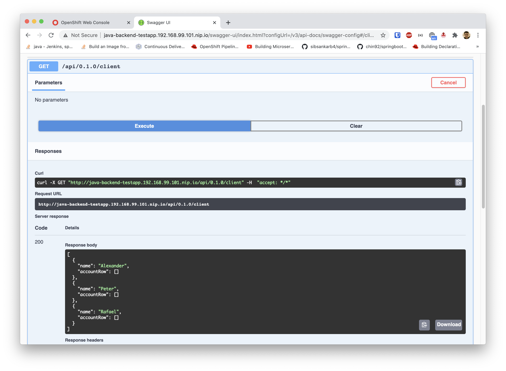

# Openshift Skills
This documentation shows, how a simple java application can be deployed to openshift (minishift) via jenkins pipeline.

More Info
- Openshift Configs: [Openshift-Config.md](_docs/Openshift-Config.md)
- Jenkins Handling: [Jenkins-Config-Handling-md](_docs/Jenkins-Config-Handling.md)

## Installation
1. Setup Mac Virutalization: [https://docs.okd.io/3.11/minishift/getting-started/setting-up-virtualization-environment.html#setting-up-hyperkit-driver](https://docs.okd.io/3.11/minishift/getting-started/setting-up-virtualization-environment.html#setting-up-hyperkit-driver)
2. Install Minishift: brew cask install minishift
3. Set rights
	- `$ sudo chmod u+s /usr/local/bin/hyperkit`
	- `$ sudo chmod u+s,+x /usr/local/bin/docker-machine-driver-hyperkit`
	- `$ udo chown root:wheel /usr/local/bin/docker-machine-driver-hyperkit && sudo chmod u+s /usr/local/bin/docker-machine-driver-hyperkit`
4. Disconnect from VPN
5. Run Minishift (with Virtualbox): 
   - First run `$ minishift start --vm-driver=virtualbox` 
   - Following runs: `$ minishift start`


Trouble Resolve:
- minishift delete --clear-cache


## Create Github Repo
- Create Readme
- Create Jenkinsfile

```groovy
pipeline {
  agent any

  stages {
    stage('test') {
      tools {
        jdk "jdk-11.0.1" // Tool defined in Jenkins -> Manage Jenkins -> Global Tool Config -> JDK (see docs)
      }
      agent {
        label 'maven' // Starts automatically
      }
      steps {
        sh "./gradlew --no-daemon clean check" // Execute Tests
      }
      post {
        always {
          junit '**/test-results/test/*.xml' // Post test results to jenkins blue
        }
      }
    }
    stage('build') {

      tools {
        jdk "jdk-11.0.1"
      }
      agent {
        label 'maven'
      }
      steps {

        sh "./gradlew clean assemble" // Generate jar

        script {
          openshift.withCluster() {

            def buildConfig = openshift.selector("bc", "java-backend") // The java-backend build script will be automatically created in the last step
            buildConfig.startBuild("--from-dir backend", "--wait")
            def builds = buildConfig.related('builds')
            builds.describe()
          }
        }
      }
    }
  }
}
```


## Install Jenkins
- Open Webconsole: [https://192.168.99.101:8443/console/catalog](https://192.168.99.101:8443/console/catalog)
- Choose service catalog
- Search for Jenkins
	- Persistent (if persistent volumes are present)
	- Ephemeral (for testing)
- Add ip to /etc/hosts (e.g. `192.168.99.101 jenkins-testapp.192.168.99.101.nip.io`)
- Open Jenkins
- Remove sample task
- Choose `New Item`
- Choose `Multibranch Pipeline`
- Choose `Periodically run` with 1 minute interval
- Connect to Github

(Screenshots)

## Create Java App
- Build Gradle
```groovy

plugins {
    id 'org.springframework.boot' version '2.3.4.RELEASE'
    id 'io.spring.dependency-management' version '1.0.10.RELEASE'
    id 'java'
}

group = 'com.example'
version = '0.0.1-SNAPSHOT'
sourceCompatibility = '11'

repositories {
    mavenCentral()
}

dependencies {
    implementation 'org.springframework.boot:spring-boot-starter-web'
	testImplementation 'org.springframework.boot:spring-boot-starter-test'

    // Open API Definition
	implementation("org.springdoc:springdoc-openapi-ui:1.4.8")

    // Testing
    testImplementation('org.springframework.boot:spring-boot-starter-test') {
        exclude group: 'org.junit.vintage', module: 'junit-vintage-engine'
    }
}

test {
    useJUnitPlatform()
}
```

- Main method
```java
@SpringBootApplication
public class HelloWorld {
  public static void main(String[] args) {
    SpringApplication.run(HelloWorld.class, args);
  }
}
```

- Controller
````java
@RestController
public class Controller {

    @GetMapping
    public String root(){
        return "Hello World";
    }
}
````


## Run with Docker locally
```dockerfile
FROM openjdk:11-slim

ARG JAR_FILE=build/libs/\*.jar

COPY ${JAR_FILE} app.jar

EXPOSE 8080

ENTRYPOINT ["java","-jar","app.jar"]
```

- `$ docker build -t fabiankuhn/mini-java .`
- `$ docker run -p 8080:8080 -d --name openshift-testapp fabiankuhn/mini-java`

Check if build works

## Create Openshift App
- `$ oc login` with credentials developer & developer
- `$ oc new-build --strategy docker --binary --docker-image openjdk:11-slim:openjdk:11-slim --name java-backend`
- `$ oc start-build java-backend --from-dir . --follow`
- `$ oc new-app myapp`
- `$ oc expose svc/myap`
- `$ oc get route myapp`

If deployment was successful, try out the pipeline build (which works identical). If necessary optimize the build and deploy configs.

## Result




