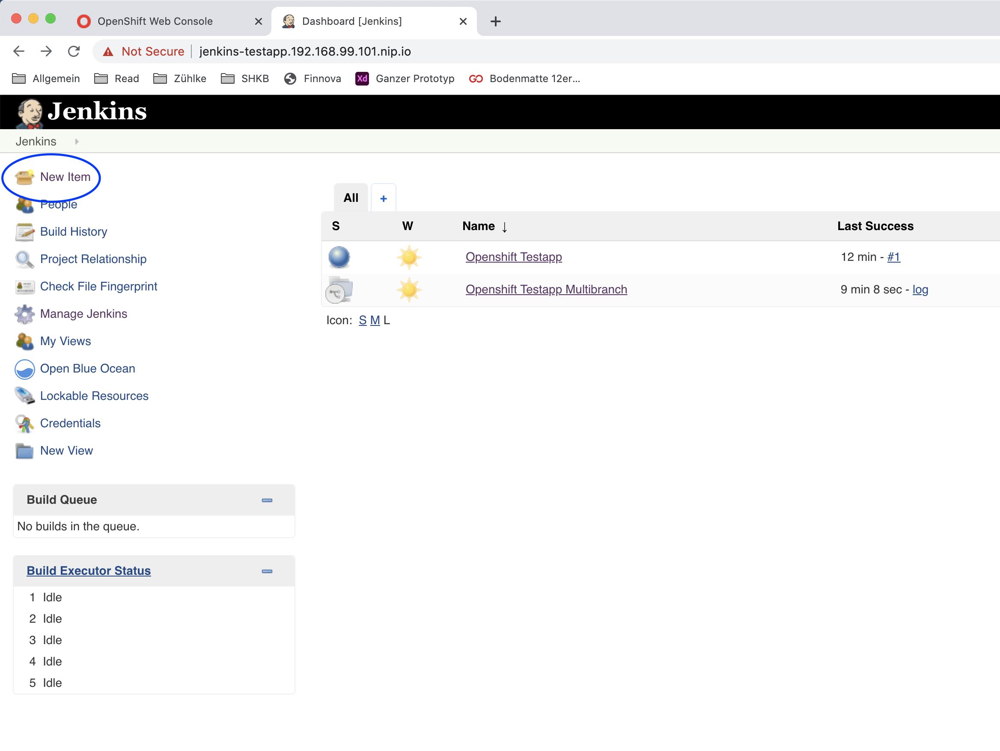
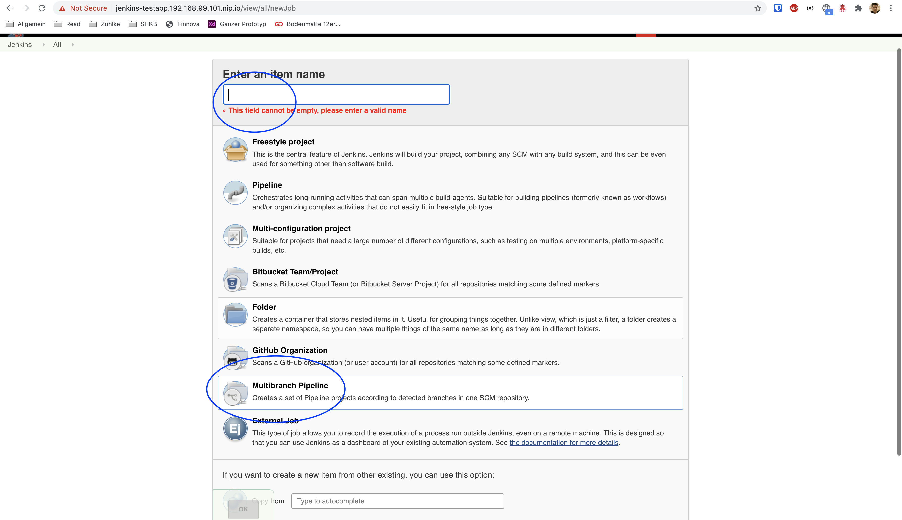
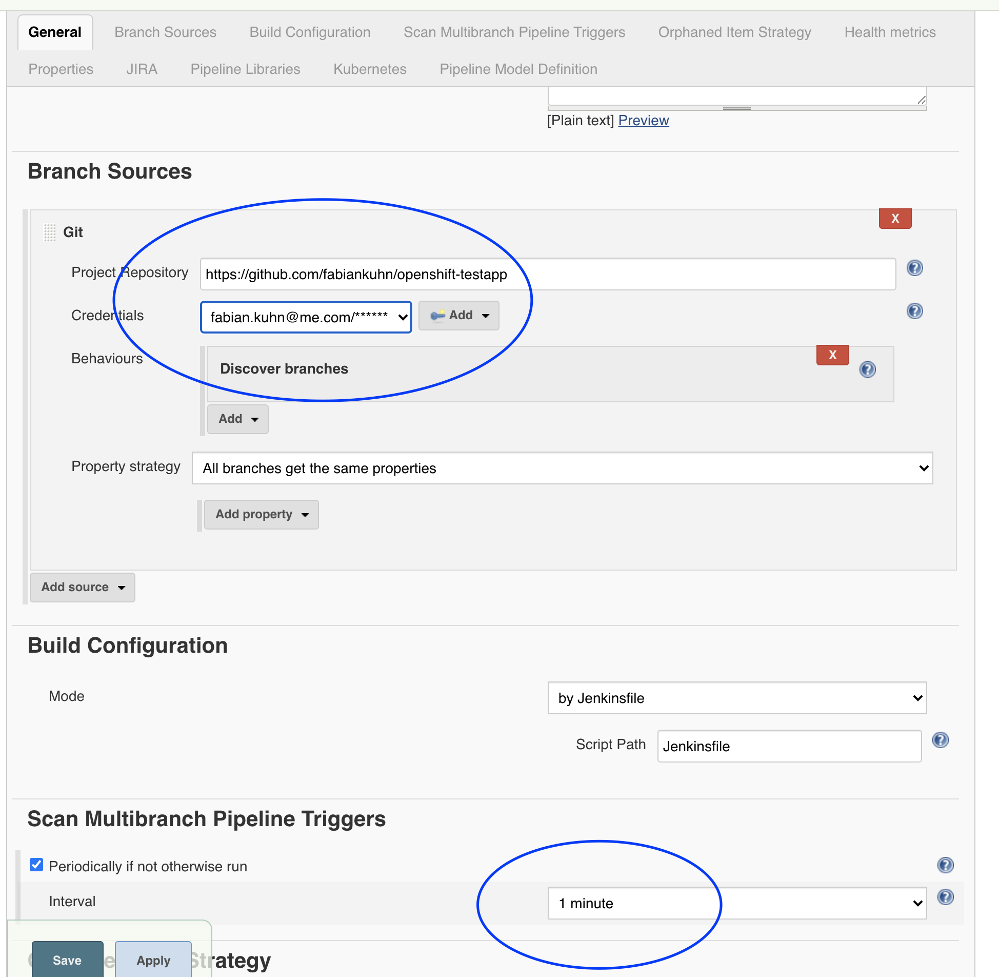
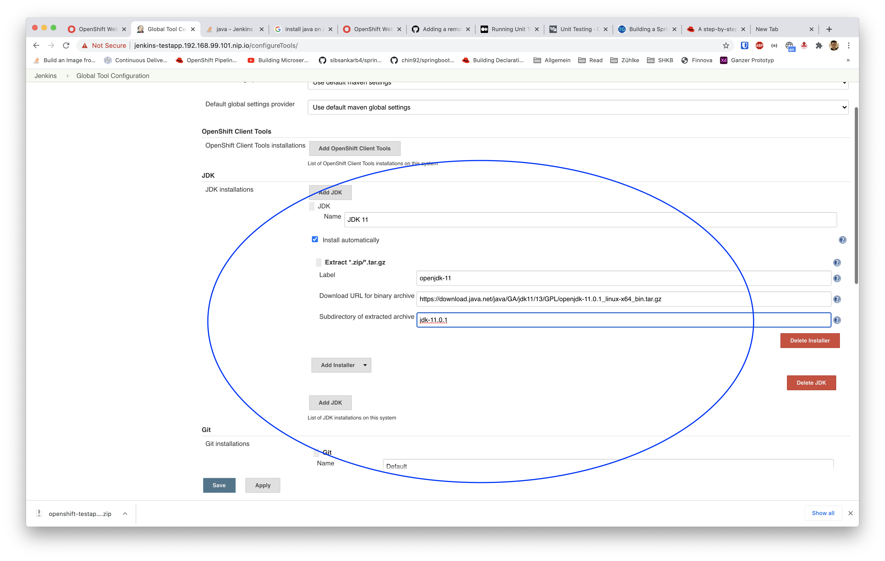
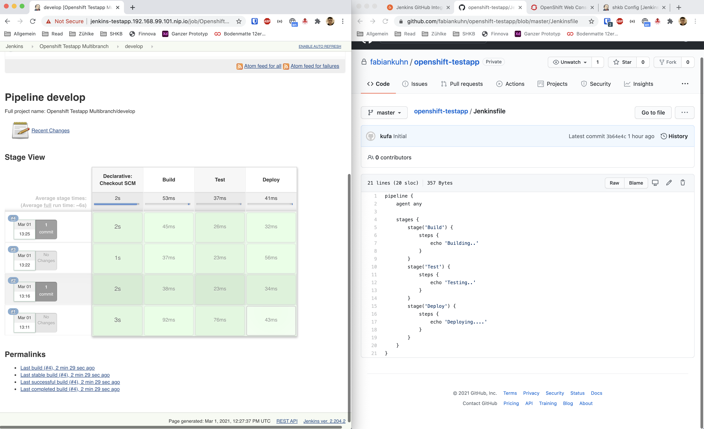

# Jenkins
Steps to set up a pipeline and for faster development

## Handling
For faster development choose replay on the deploy. This will directly relaunch the jenkins build.


## Config Pipeline
Follow steps to set up multibranch pipeline

1. Add new Item

   
2. Select Multibranch pipeline

   
3. Setup Git connection


4. Setup JDK


In the pipeline:
```groovy
tools {
    jdk "jdk-11.0.1"
}
```

5. Result

