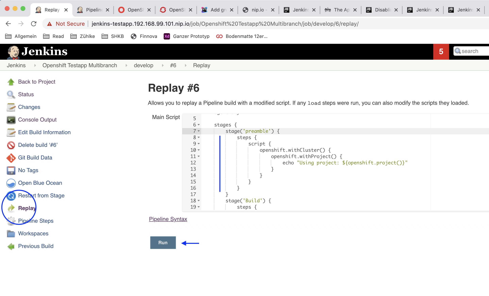
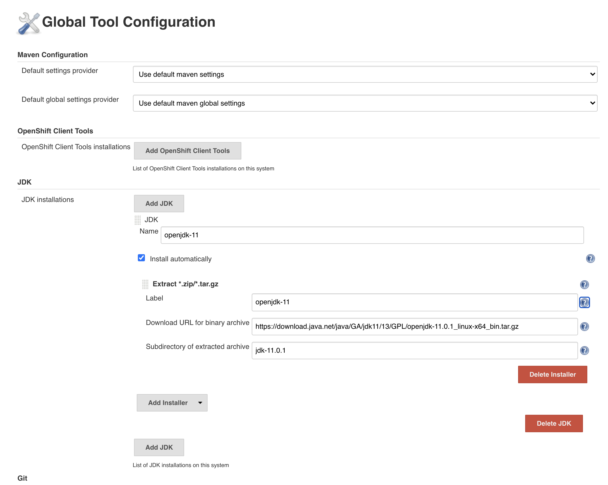

# Jenkins
Steps to set up a pipeline and for faster development

## Handling
For faster development choose replay on the deploy. This will directly relaunch the jenkins build.


## Config Pipeline
Follow steps to set up multibranch pipeline

1. Add new Item

   
2. Select Multibranch pipeline

   
3. Setup Git connection


4. Setup JDK
Use with Name "JDK 17"


In the pipeline:
```groovy
tools {
    jdk "JDK 17"
}
```

5. Result

